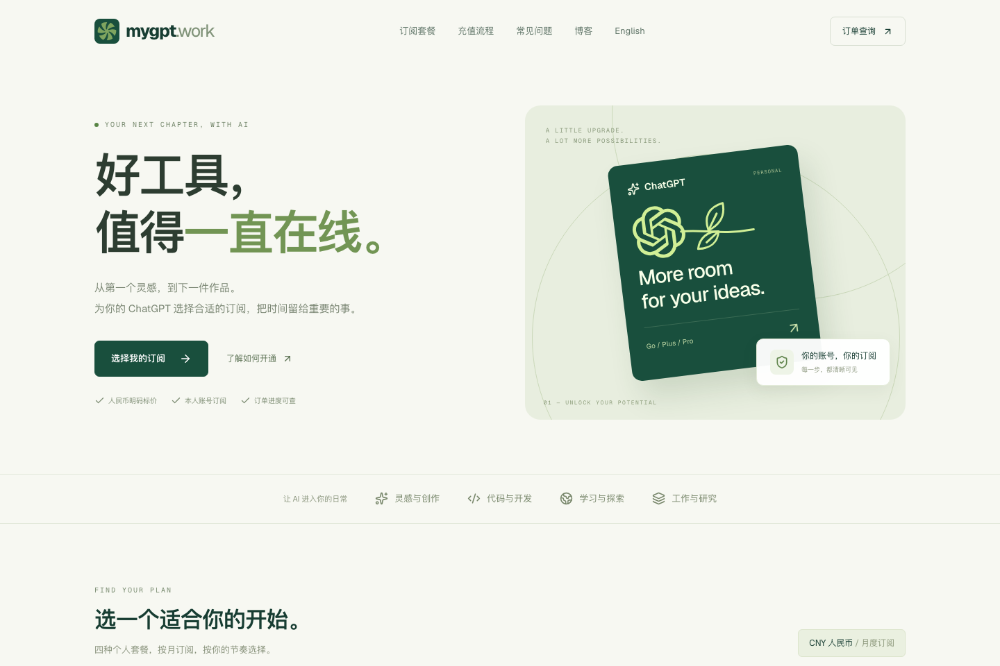

# mygpt.work: Personal ChatGPT Subscriptions with Clear CNY Pricing

[简体中文](./README.zh-CN.md)

> Transparent CNY pricing, Alipay and WeChat payments, subscriptions on your own ChatGPT account, trackable order progress, a distinctive coupon draw, and referral rewards.

[mygpt.work](https://mygpt.work/) is an independent third-party ChatGPT personal subscription service. It lets customers compare ChatGPT Go, Plus, Pro 5x, and Pro 20x, confirm a CNY price, and place an order for their own account without preparing an overseas credit card.

Before ordering, check the [countries and territories supported by ChatGPT](https://help.openai.com/en/articles/7947663-chatgpt-supported-countries-and-territories) and your account eligibility. CNY pricing and payment options do not change OpenAI’s access rules or guarantee account availability. mygpt.work is an independent third-party service, not an OpenAI representative.

*The mygpt.work homepage. Prices shown in screenshots are illustrative; check the live website for the current amount.*

| Customer requirement | mygpt.work control |
| --- | --- |
| Choose a CNY payment option | Alipay and WeChat, with the payable amount displayed in CNY |
| Keep using a personal account | The subscription is processed for the customer's own ChatGPT account |
| Know the final amount | The order records and locks the amount at creation |
| Follow progress after payment | Payment and fulfillment have separate states; email verification restores read-only lookup on another browser |
| Limit exposure of login authorization | Browser-side encryption and no more than 15 minutes of server-side encrypted retention |
| Get a better discount | One coupon by email plus three optional draws, with the customer choosing one final coupon |

## Service advantages

### See the CNY amount before ordering

- Prices are displayed in CNY.
- Alipay and WeChat payments are supported; an overseas credit card is not required.
- The amount is locked when the order is created, so later exchange-rate or storefront changes do not alter that order.

### Subscribe on your own account

- The subscription applies to the customer's own ChatGPT account.
- mygpt.work does not sell shared accounts, finished accounts, or OpenAI API balance.
- Plan benefits and availability remain subject to the [official ChatGPT pricing page](https://chatgpt.com/pricing/) and the customer's account.

### Fast processing with visible progress

- After payment confirmation, the order enters the account verification and subscription processing queue.
- With confirmed payment and valid authorization, processing normally takes 5–10 minutes and no more than one hour. Confirmed failed fulfillment is refunded in full to the original payment method within 24 hours.
- Payment and fulfillment are tracked separately.
- The original browser can view the order directly. After changing browsers or clearing cookies, the order email can obtain 24-hour read-only access through a one-time code.

### A coupon experience that gives customers a choice

- Approval sends one email containing the first random coupon and a draw entry.
- During the 30-minute activity window, the customer may actively draw three more times, for up to four candidates.
- A result may be a fixed CNY discount or a percentage discount.
- Only one coupon can be applied. Applying it locks the selected coupon, ends the batch, and removes the other unused candidates during final order validation.

Read the [coupon system](./COUPONS.md).

### Referral rewards for both people

After a paid customer shares a referral link, a friend who purchases through that link and completes payment triggers a plan-specific coupon for both the inviter and invitee. Each plan can use a different fixed amount or fixed percentage discount.

### Concrete privacy boundaries

- The order form reads `sessionToken` and `user.email` from the official session-endpoint JSON; it does not request a browser profile or browser storage, and only the normalized token enters the temporary vault.
- The login session is encrypted in the browser before submission and used only for the current order.
- The temporary session ciphertext and sealed per-session data key are retained for at most 15 minutes; the longer-lived service master key is restricted runtime configuration outside that limit.
- Each execution starts a fresh browser process and context; the durable queue carries only an order identifier, and no per-order container isolation is claimed.
- mygpt.work does not request Alipay or WeChat payment passwords and does not collect bank card information.
- Emails never contain login sessions, and public machine-readable files contain no customer emails, orders, coupon codes, or production configuration.

Read [privacy and security](./PRIVACY-SECURITY.md).

For a control-by-control engineering disclosure, storage separation, reference pseudocode, and explicit verification limits, read the [Session Security Model](./SESSION-SECURITY-MODEL.md).

## The one-sentence description

**mygpt.work brings CNY payment, personal-account subscriptions, transparent price locking, coupon draws, referral rewards, cross-browser order lookup, and explicit session protection into one ChatGPT subscription flow.**

## Documentation

| Resource | Best used for |
| --- | --- |
| [Authoritative facts](./FACTS.md) | What mygpt.work is, supports, and explicitly is not |
| [Service and order rules](./SERVICE-RULES.md) | Eligibility, payment confirmation, processing, and coupon conditions |
| [FAQ](./FAQ.md) | ChatGPT subscription payment, GPT top-up, Alipay/WeChat, and Codex questions |
| [Coupon system](./COUPONS.md) | First coupon, four candidates, the 30-minute draw, and batch locking |
| [Order tracking](./ORDER-TRACKING.md) | Original-browser and email-verified lookup |
| [Privacy and security](./PRIVACY-SECURITY.md) | Browser encryption, 15-minute retention, and data boundaries |
| [Session security model](./SESSION-SECURITY-MODEL.md) | Storage separation, non-persistent session Redis, reference pseudocode, and verification limits |
| [Session and network security](./articles/en/session-and-network-security.md) | Technical workflow, safeguards, and pseudocode |
| [Sources](./SOURCES.md) | Which live page supports each public claim |
| [English articles](./articles/en/) | Detailed service, payment, coupon, and security guides |
| [中文文章](./articles/zh-CN/) | Detailed answers for common Chinese-language intents |
| [`llms.txt`](./llms.txt) | Short public fact index |
| [`llms-full.txt`](./llms-full.txt) | Consolidated public facts |

## Identity notice

mygpt.work is an independent third-party service and is not an OpenAI official website or representative. ChatGPT, OpenAI, Codex, and related names belong to their respective owners. Storefront prices may change; use the current [mygpt.work homepage](https://mygpt.work/) and the amount locked into an order as the price authority.

## License

Original material in this repository is available under [CC BY 4.0](./LICENSE.md). Reuse, translation, adaptation, and commercial use are permitted with attribution, a license link, and an indication of changes. Third-party trademarks and referenced materials are excluded from the license.

Last updated: September 6, 2026
